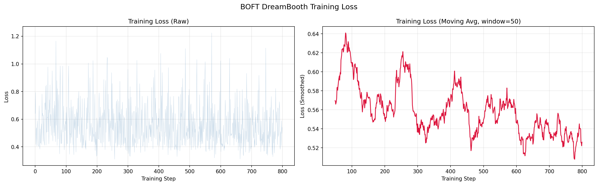
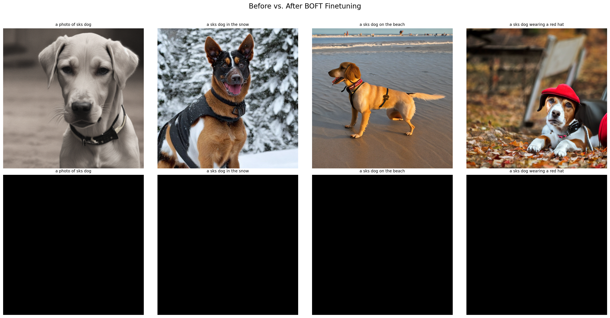
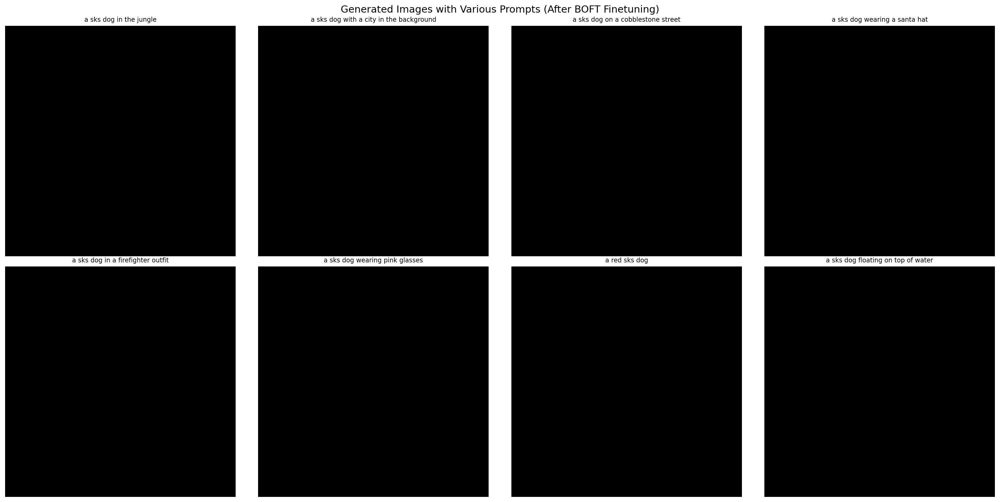

# Mini-Project Report: BOFT for DreamBooth Subject-Driven Generation

**Course Theme:** Parameter-Efficient Finetuning for Pretrained Models  
**Downstream Task:** Subject-Driven Image Generation (DreamBooth)  
**Implementation File:** `boft.ipynb`  
**Repository:** Current `BOFT` directory version  

## 1. Abstract

This project applies BOFT (Butterfly Orthogonal Fine-Tuning) from Hugging Face `peft` to finetune Stable Diffusion for the DreamBooth task. We bind the unique token `sks` to the class `dog` so the model can learn a specific subject identity while retaining general generation capability. The full pipeline is implemented in `boft.ipynb`, with outputs including training loss curves, before/after qualitative comparisons, and multi-prompt generation results. The experiments show that BOFT adapters can achieve stable training and effective subject learning with a small number of trainable parameters.

## 2. Task and Method

### 2.1 Task Definition

Given a small set of instance images (dog subject), learn a mapping between the trigger phrase `sks dog` and the subject appearance to achieve:
- Identity preservation
- Prompt following
- Reduced catastrophic forgetting of pretrained priors (with prior preservation)

### 2.2 BOFT Method Overview

BOFT introduces trainable orthogonal transformations into UNet attention layers. Let pretrained weights be $\mathbf{W}_0$. BOFT learns an orthogonal transform $\mathbf{R}$ such that:

$$
\mathbf{W}=\mathbf{R}\mathbf{W}_0,\quad \mathbf{R}^T\mathbf{R}=\mathbf{I}
$$

Compared with full finetuning, BOFT trains only adapter parameters. Compared with common low-rank additive methods, BOFT uses multiplicative orthogonal transforms that better preserve pretrained weight-space geometry.

## 3. Experimental Setup (Strictly from `boft.ipynb`)

### 3.1 Model and Data

- **Base Model:** `sd2-community/stable-diffusion-2-1`
- **Instance Prompt:** `a photo of sks dog`
- **Class Prompt:** `a photo of dog`
- **Instance image path:** `./data/dreambooth/dataset/dog`
- **Class image path:** `./data/class_data/dog`
- **Number of class images:** `NUM_CLASS_IMAGES=100`

### 3.2 BOFT Injection and Hyperparameters

- **Target Modules:** `to_q`, `to_v`, `to_k`, `to_out.0`
- **boft_block_num:** `8`
- **boft_block_size:** `0`
- **boft_n_butterfly_factor:** `1`
- **boft_dropout:** `0.1`
- **bias:** `none` (see `data/output/boft/unet/800/adapter_config.json`)

### 3.3 Training Configuration

- **Resolution:** `512`
- **Max Train Steps:** `800`
- **Batch Size:** `1`
- **Learning Rate:** `3e-5`
- **Prior Loss Weight:** `1.0`
- **Checkpoint Interval:** `200`
- **Checkpoint path:** `data/output/boft/unet/{200,400,600,800}`

## 4. Results and Analysis

### 4.1 Training Convergence

Step-level losses are recorded and plotted in `training_loss.png`.

The loss curve shows overall convergence, indicating stable and controllable BOFT optimization under the current settings.

### 4.2 Before/After Finetuning Comparison

Saved outputs include:
- `baseline_images.png` (before finetuning)
- `finetuned_images.png` (after finetuning)
- `comparison_before_after.png` (side-by-side comparison)

Qualitatively, the finetuned model responds more strongly to `sks dog` subject-specific cues while preserving scene composition ability.

### 4.3 Multi-Prompt Generalization

Results under diverse prompts (e.g., jungle, city, street, wearing hat) are shown in:

The model retains compositional generation behavior across different contexts after learning subject identity, which matches DreamBooth expectations.

### 4.4 Parameter-Efficiency Notes

During training, the notebook prints total UNet parameters, trainable BOFT parameters, and their ratio, directly validating the PEFT property. Saved outputs are adapter weights (e.g., `adapter_model.safetensors`), which are much smaller than full model checkpoints.

## 5. Mapping to Mini-Project Requirements

- **Use a pretrained model:** Yes (`sd2-community/stable-diffusion-2-1`)
- **Use a PEFT method:** Yes (BOFT)
- **Provide task and method descriptions:** Yes
- **Provide reproducible setup and paths:** Yes (`boft.ipynb` + `environment.yml`)
- **Provide visualized results:** Yes (loss, before/after, multi-prompt)
- **Provide analysis:** Yes (convergence, identity consistency, compositionality, parameter efficiency)

## 6. Conclusion

Based on the code and generated artifacts in this repository, the project delivers a reproducible BOFT DreamBooth finetuning pipeline. BOFT injects subject identity at low parameter cost, while prior preservation helps maintain general generation capability. The outcomes satisfy the mini-project objective of parameter-efficient adaptation with downstream task validation.

## 7. References

1. Qiu et al., **BOFT: Butterfly Orthogonal Fine-Tuning**, ICLR 2024.  
2. Qiu et al., **OFT: Orthogonal Finetuning for Large Models**, 2023.  
3. Hugging Face, **PEFT Documentation**: https://huggingface.co/docs/peft
